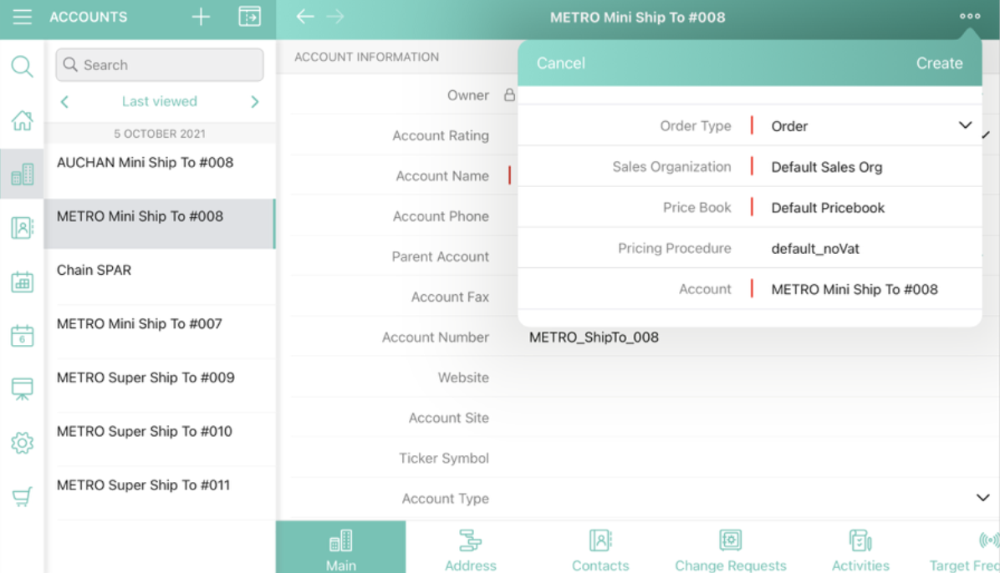
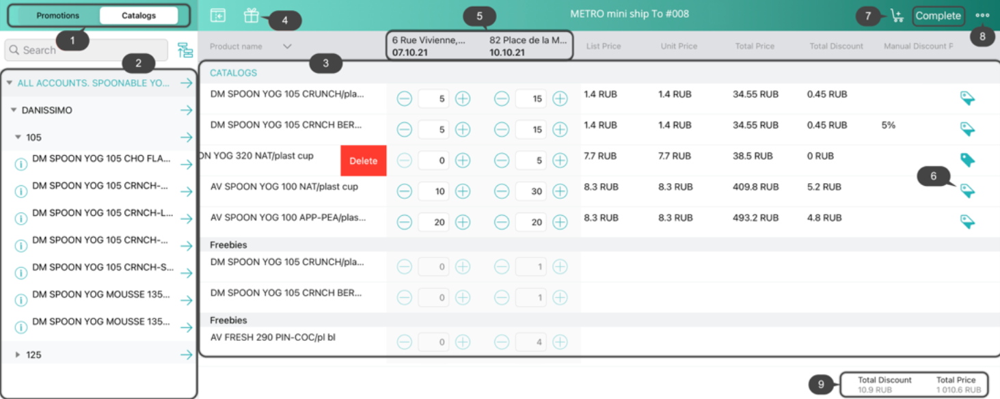
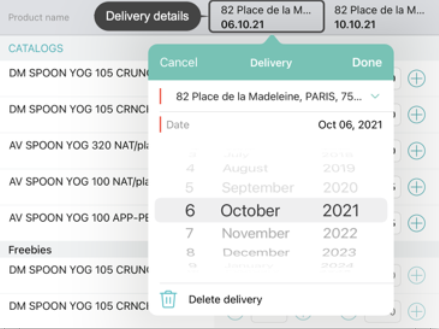
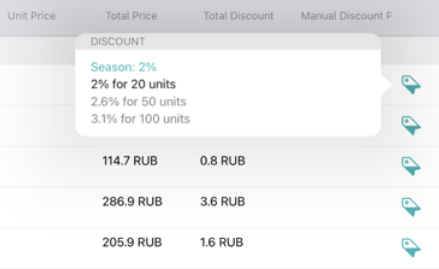
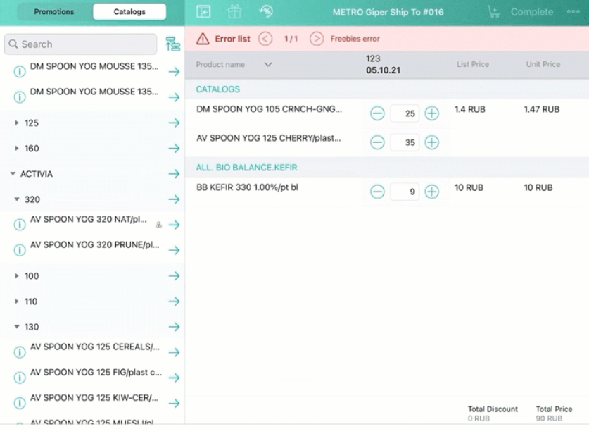
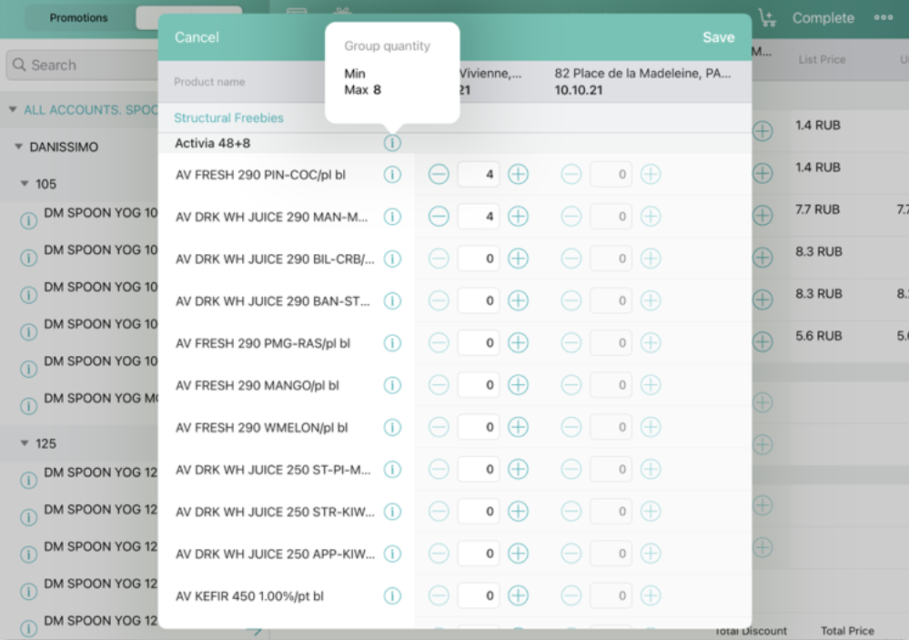
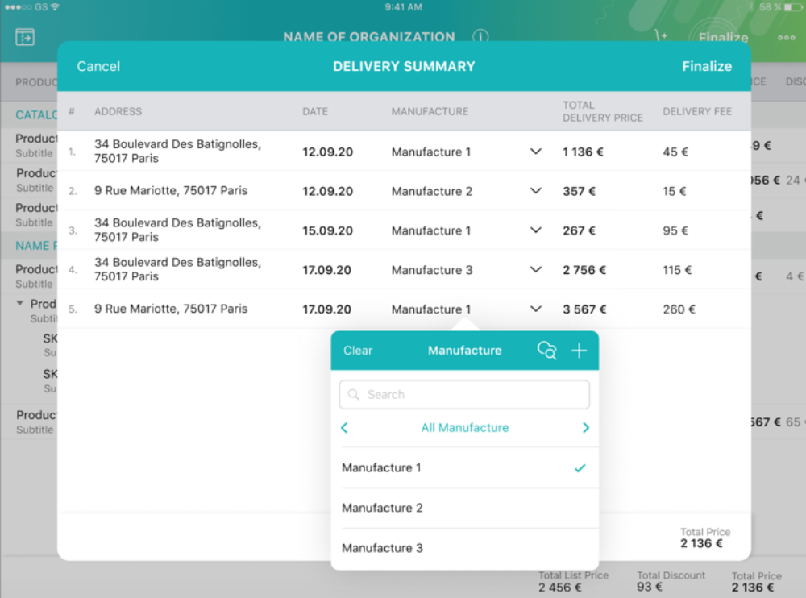

# Order Creation

## Order setup

The Offline Order creation process can be started from the `Actions` menu on the *Account*, *Contact*, or *Activity* records.

1. Tap the Actions menu button  on the selected record. 
2. In the popped-up window tap on the **Order** button.
3. Define the order settings that are displayed on the mini-layout:
   + Sales Organization;
   + Order Type;
   + Price Book;
   + Account.

    :::info
    This is a default layout. Other fields, as Contact, Record Type, etc. can be added by setting up a Layout Setting record for the CT Order object.
    :::
    
4. Tap **Create**.    
   A new **Order Cart** screen will open. 

## Managing the Order Cart

The Order Cart allows you to add products, distribute freebies and set up the deliveries.
The layout includes the following elements:
+ Promotions and Catalogs tabs (1).
+ List of the products (2) corresponding to the selected tab (1).
+ List of the products and freebies added to the order cart (3).
+ A button to open the Freebies management window (4).
+ Created Deliveries (5).
+ Price Tags (6).
+ A button to Add Delivery (7).
+ Actions button (8).
+ Order's totals information (9).
+ Complete button to finalize the order.

On the Order Cart screen:
1. Tap on the Catalogs or Promotions tab (1) to unfold the appropriate list of products (2).
2. To add a product or a *bundle* to the order cart tap on the arrow on the right of the item.
   :::info
   The product cannot be added to the order cart if it has no assigned `CT Price Book`, `CT Price Book Line Item`, and `List Price` objects.
   :::
3. The delivery details window will open up.
   + Tap on Address to specify this delivery destination, if multiple shipment addresses are assigned to the current Account.
   + Tap on Date to open the date selector and scroll to the required date. By default, the first available delivery date is set.
        :::info
        The start and end delivery dates, as well as the number of available deliveries per order, are defined by the administrator in the `Limit Setting`.
        :::
        
4. Add other products from the Catalogs or Promo lists to the first delivery by tapping the arrow icon to the right.
5. Set up the quantities per each of the added product.
To completely remove the product from the cart swipe it to the left and tap **Delete**.
6. Tap on the cart icon (7) in the header to create a second delivery.
   :::note
   When you reach the limit for the number of deliveries, the button will become inactive.
   :::
7. Repeat steps 4-6 to form a delivery.
8. To edit or delete created deliveries click on the delivery details again to open the pop-up window.
9. Additional icons (6) of the Price Tags can be added to the layout with the information on the
currently applied discounts or any custom information if the custom price tags were set up.

If a **Procedure Step** was implemented for the price recalculation based on the conditions specified in the **Calculation Type** a dedicated button will be displayed.

## Managing freebies

1. To add Freebies to the Order cart, tap on the Freebies button (4).
2. The Freebies window will open up.
    
3. The number of freebies will be granted automatically according to the set conditions. Tap **Save**.
4. If you have changed the amount of the products in the product cart tap the Freebies button again.
5. The number of freebies will be automatically recalculated and the message will be displayed. Tap Save.

## Finalizing the Order

When all the products are added, freebies distributed and the deliveries set, tap the **Complete** button to finalize the order.  
Alternatively, if you want to save the order as a draft and plan to edit it later, tap on the **Actions** button (8) and then on **Save draft**, or **Cancel** order if you want to delete the order completely.  
You can also set up the Delivery Summary window to display the order overview including the distribution of the products by the created deliveries, set by the Order
split.

